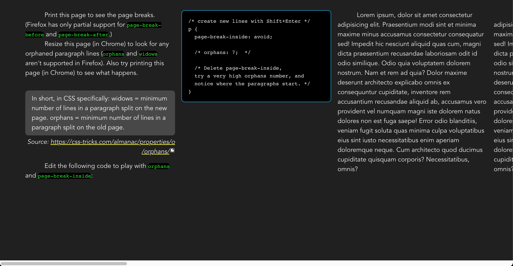
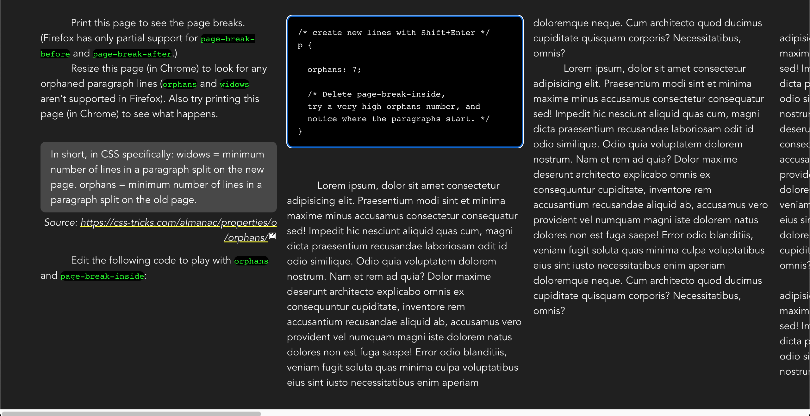
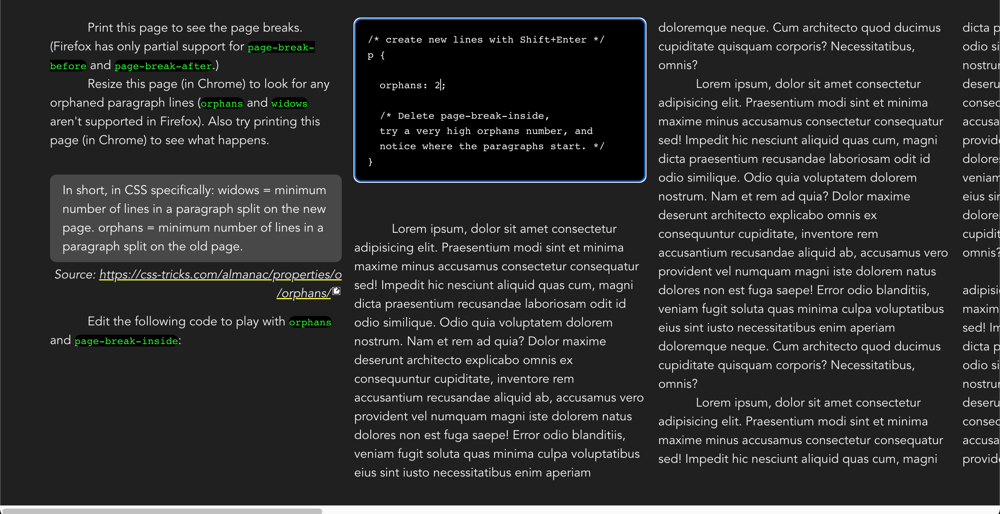

# CSS print example

(Use [`parcel`](https://github.com/hchiam/learning-parcel))

```sh
parcel index.html
# http://localhost:1234
```

Demo of:

- `orphans` and `widows`
- `page-break-before` and `page-break-after`
- `page-break-inside`

## Avoid page breaks in paragraphs with `page-break-inside: avoid`



## `orphans: 7` for minimum 7 lines before page break



## `orphans: 2` for minimum 2 lines before page break



## Neither page break set nor orphans set


## More notes

```css
.cross-browser-support { /* Chrome, Firefox, Edge, but maybe not Safari */
  page-break-inside: avoid;
  break-inside: avoid;
  display: inline-block;
  width: 100%;
}
```

- To get `break-after: avoid;` to work cross-browser (e.g. Firefox and Safari don’t support the `avoid` value specifically for `break-after`), you’ll need to use an `:after` pseudo-element that increases the element’s effective height from the point of view of the page break algorithm, but that also doesn’t unnecessarily shift the elements below it: https://stackoverflow.com/a/53742871
