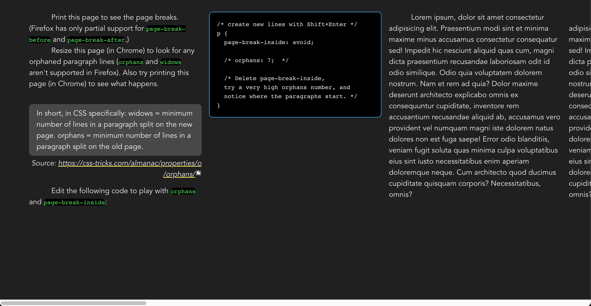
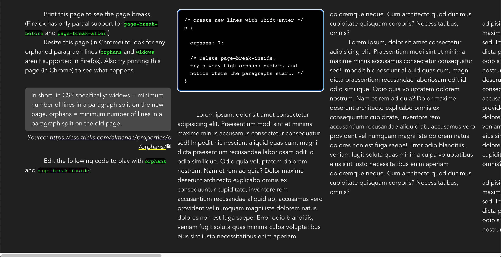
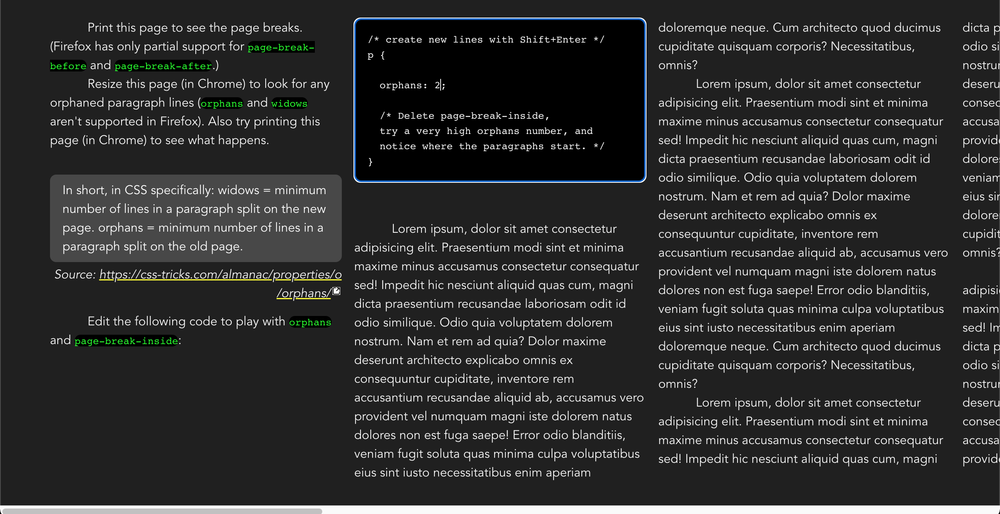

# CSS print example

(Use [`parcel`](https://github.com/hchiam/learning-parcel))

```sh
parcel index.html
# http://localhost:1234
```

Demo of:

- `orphans` and `widows`
- `page-break-before` and `page-break-after`
- `page-break-inside`

## Avoid page breaks in paragraphs with `page-break-inside: avoid`



## `orphans: 7` for minimum 7 lines before page break



## `orphans: 2` for minimum 2 lines before page break



## Neither page break set nor orphans set


## More notes

```css
.cross-browser-support { /* Chrome, Firefox, Edge, but maybe not Safari */
  page-break-inside: avoid;
  break-inside: avoid;
  display: inline-block;
  width: 100%;
}
```

- Firefox respects `break-inside: avoid;` but silently ignores [`break-after: avoid;`](https://developer.mozilla.org/en-US/docs/Web/CSS/Reference/Properties/break-after#browser_compatibility) and [`break-before: avoid;`](https://developer.mozilla.org/en-US/docs/Web/CSS/Reference/Properties/break-before#browser_compatibility) ("The value is recognized, but has no effect.")

  - so you might want to add `break-inside: avoid;` to the direct parent of the elements you're trying to keep together during printing

- To get `break-after: avoid;` to work cross-browser (e.g. Firefox and Safari don’t support the `avoid` value specifically for `break-after`), you’ll need to use an `:after` pseudo-element that increases the element’s effective height from the point of view of the page break algorithm, but that also doesn’t unnecessarily shift the elements below it: <https://stackoverflow.com/a/53742871>

  - _**UPDATE:**_ Firefox can't have a `display: flex;` flexbox container for the element or for any of its parents/ancestors if you want page breaks - <https://stackoverflow.com/questions/26036663/page-break-after-not-working-in-flexboxes> - so you might want to add `display: table; width: 100%;` to your element, and maybe also add `break-inside: avoid;` to the direct parent of your element

```css
.thing {
  page-break-after: avoid;
  break-after: avoid;
}
.thing::after {
  content: "";
  display: block;
  height: 100px;
  margin-bottom: -100px;
}
```
