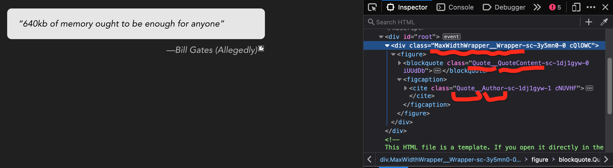

# example [React.js](https://github.com/hchiam/learning-reactjs) app using [`styled-components`](https://github.com/styled-components/styled-components)

If you want to start from scratch:

```sh
npx create-react-app react-app; cd react-app; npm install --save styled-components; npm install --save-dev babel-plugin-styled-components@1.13.3; npm run start;
```

If you want to use this demo:

```sh
cd react-app-using-styled-components; npm install; npm run start;
```

To make it easier to find components when inspecting in DevTools, you can make the class names more readable by using `babel-plugin-styled-components@1.13.3`, and then changing `import styled from 'styled-components';` to `import styled from 'styled-components/macro'`. ([Why version 1.13.3? See my demo repo for notes on a temporary fix.](https://github.com/hchiam/react-app-using-styled-components#a-temporary-fix))



You can get VSCode syntax highlighting and auto-complete for styled-components: https://styled-components.com/docs/tooling#syntax-highlighting

`styled-components` can also do SSR (like with Next.js): https://styled-components.com/docs/advanced#server-side-rendering
